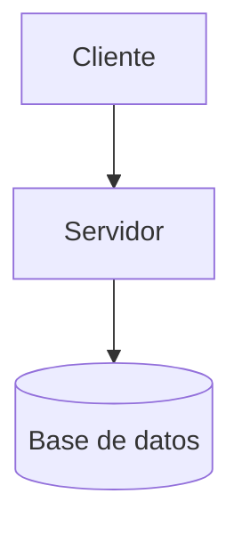

# Quiz JCyL — Técnico Superior de Informática

Aplicación web SPA construida con **Angular 17** para practicar los exámenes de oposición de **Técnico Superior de Informática de la Junta de Castilla y León (JCyL)** y otras convocatorias relacionadas.

---

## ✨ Funcionalidades

### 📝 Tests tipo test
- **Selección de examen**: listado de convocatorias disponibles cargado desde `assets/tests/index.json`.
- **Configuración antes de empezar**:
  - Activar/desactivar mezcla aleatoria de preguntas y respuestas.
  - Filtrar por bloques temáticos mediante chips seleccionables.
  - Resumen dinámico del número de preguntas seleccionadas.
- **Sesión en curso**: si se abandona un test a mitad, la sesión se guarda en `localStorage` y se puede retomar o descartar desde la pantalla de selección.
- **Realización del quiz**:
  - Navegación pregunta a pregunta con indicador de progreso.
  - Opción de dejar la pregunta en blanco.
  - Feedback inmediato al responder (respuesta correcta/incorrecta con explicación).
- **Resultados**:
  - Puntuación global con círculo de color (verde/naranja/rojo según nota).
  - Desglose por bloques temáticos (aciertos, fallos y porcentaje por tema).
  - Listado de preguntas falladas con la respuesta correcta y su explicación.
  - Opciones para repetir el test o volver al inicio.
- **Estadísticas históricas** (`/stats`):
  - KPIs globales: sesiones completadas, preguntas respondidas, porcentaje de acierto global y mejor sesión.
  - Historial agrupado por convocatoria con detalle de cada sesión.
  - Botón para borrar todo el historial.

### 📋 Supuestos Prácticos
- **Menú de navegación** con dos modos de exploración:
  - **Por Examen** (`/supuestos/examenes`): preguntas agrupadas por convocatoria. Cada grupo muestra el número de preguntas y permite expandir/colapsar.
    - Botón "Ver plantilla de examen": carga y renderiza el fichero Markdown de la convocatoria con formato completo (encabezados, tablas, código, blockquotes, **diagramas Mermaid** y **fórmulas matemáticas LaTeX**).
  - **Por Categoría** (`/supuestos/categorias`): preguntas agrupadas por bloque temático.
  - **Consejos** (`/supuestos/consejos`): listado de consejos y recomendaciones técnicas mostrados en formato tarjetas.
    - Al abrir una tarjeta, se muestra el contenido formateado del fichero Markdown correspondiente (con soporte para tablas, Mermaid y LaTeX).
- Los supuestos se cargan desde `assets/supuestos/categorias.json` y los ficheros `.md` asociados a cada convocatoria. Los consejos se cargan desde `assets/supuestos/tips/tips.json` y sus respectivos ficheros Markdown.

---

## 🗂️ Estructura de datos

### Tests — `assets/tests/index.json`
```json
[
  {
    "id": "test-2024",
    "nombre": "Técnico Superior de Informática — JCyL",
    "ejercicio": "Primer Ejercicio",
    "fecha": "26 de octubre de 2024",
    "fichero": "tests/test-2024.json"
  }
]
```

Cada fichero de test (`assets/tests/*.json`) contiene un array de preguntas con campos: `enunciado`, `opciones`, `correcta`, `tema` y `explicacion`.

### Supuestos — `assets/supuestos/categorias.json`
Array de categorías, cada una con nombre y array de preguntas (`enunciado`, `origen`, y datos de respuesta). Los ficheros Markdown de plantillas se ubican en `assets/supuestos/*.md`.

### Consejos — `assets/supuestos/tips/tips.json`
Índice de consejos con campos: `id`, `title`, `description`, `icon` y `file`. Los contenidos se redactan en ficheros Markdown dentro de `assets/supuestos/tips/*.md`.

---

## 🖋️ Renderizado de Markdown, Mermaid y LaTeX

La aplicación renderiza ficheros `.md` enriquecidos en varios puntos (plantillas de examen en supuestos y contenido de consejos/tips). Todo el pipeline de renderizado está centralizado en la utilidad **`src/app/core/utils/markdown-render.util.ts`** y la configuración global de **`app.config.ts`**.

### Pipeline de renderizado

El orden de las transformaciones es crítico para evitar que un paso corrompa la salida del siguiente:

```
Texto Markdown (.md)
       │
       ▼
 1. Extracción de LaTeX → placeholders opacos  (renderMarkdown util)
       │
       ▼
 2. marked.parse()  →  HTML con <div class="mermaid">…</div>  (marked renderer en app.config)
       │
       ▼
 3. Restauración de placeholders → HTML de KaTeX             (renderMarkdown util)
       │
       ▼
 4. DomSanitizer.bypassSecurityTrustHtml()  →  [innerHTML]   (componente Angular)
       │
       ▼
 5. mermaid.run()  tras setTimeout(150ms)                    (componente Angular)
       │
       ▼
     DOM final con diagramas SVG + fórmulas KaTeX
```

### 1. LaTeX — fórmulas matemáticas

Se usa **KaTeX** para renderizar notación matemática. Se soportan dos modalidades:

| Sintaxis en Markdown | Tipo | Ejemplo |
|---|---|---|
| `$expresión$` | Inline (en línea con el texto) | `$2^n \ge N$` |
| `$$expresión$$` | Display (bloque centrado) | `$$\sum_{i=0}^{n} i = \frac{n(n+1)}{2}$$` |

**Por qué se usan placeholders**: `marked` v18 procesa el Markdown antes de que KaTeX actúe, y escaparía los caracteres especiales de LaTeX (`_`, `^`, `\`, `{`, `}`), corrompiendo las fórmulas. La estrategia de placeholders extrae las fórmulas **antes** de `marked.parse()`, renderiza con KaTeX y luego restaura el HTML resultante, de forma que `marked` nunca ve el contenido LaTeX.

> ⚠️ Las fórmulas en los ficheros `.md` **no deben estar envueltas en backticks** (`` ` ``), ya que eso haría que `marked` las tratara como bloques de código antes de cualquier procesamiento.

### 2. Mermaid — diagramas

Se usa **Mermaid** para renderizar diagramas definidos como bloques de código fenced con el lenguaje `mermaid`:

````markdown

````

**Flujo**:
1. El renderer personalizado de `marked` (configurado en `app.config.ts`) intercepta los bloques ` ```mermaid ``` ` y los convierte en `<div class="mermaid">…</div>` con el código fuente en texto plano.
2. `marked` v18 HTML-codifica el contenido de los bloques de código; el renderer incluye una función `decodeHtmlEntities()` para revertir esa codificación antes de pasársela a Mermaid.
3. Tras insertar el HTML en el DOM con `[innerHTML]`, se llama a `mermaid.run()` con un `setTimeout(150ms)` para asegurar que Angular ha volcado el binding al DOM real antes de que Mermaid intente procesar los `<div class="mermaid">`.

Tipos de diagrama soportados (los que incluye Mermaid 11): `graph`/`flowchart`, `sequenceDiagram`, `erDiagram`, `stateDiagram-v2`, `gantt`, `gitGraph`, `pie`, `mindmap`, `block`, etc.

### 3. Tablas y resto de Markdown

`marked` v18 con configuración por defecto renderiza:

- Encabezados (`#`, `##`, `###`)
- **Negrita**, *cursiva*, ~~tachado~~
- Listas ordenadas y desordenadas
- Tablas GFM (GitHub Flavored Markdown)
- Bloques de código con resaltado de lenguaje
- Blockquotes (`>`)
- Líneas horizontales, enlaces e imágenes

### 4. Configuración global (`app.config.ts`)

Para evitar efectos secundarios por múltiples llamadas a `marked.use()` o `mermaid.initialize()`, ambas configuraciones se realizan **una única vez** al arrancar la aplicación:

```typescript
// Renderer personalizado: bloques ```mermaid``` → <div class="mermaid">
marked.use({ renderer: { code({ text, lang }) { … } } });

// Mermaid sin auto-arranque
mermaid.initialize({ startOnLoad: false, theme: 'default' });
```

### 5. CSS necesario

El CSS de KaTeX se incluye como hoja de estilos global en `angular.json`:

```json
"styles": [
  "node_modules/katex/dist/katex.min.css",
  "src/styles.css"
]
```

Los estilos de la zona de contenido Markdown (`.md-body`) se definen con `::ng-deep` en cada componente que renderiza contenido enriquecido.

---

## 🚀 Desarrollo local

```bash
npm install
npm start        # http://localhost:4200
```

### Build de producción
```bash
npm run build    # Genera dist/quiz-angular/
```

### Tests unitarios
```bash
npm test
```

---

## 🐳 Despliegue con Docker

La aplicación incluye un `Dockerfile` multi-stage:

1. **Stage `build`** — Node 18: instala dependencias y compila con `ng build`.
2. **Stage final** — Nginx Alpine: sirve los estáticos del build en el puerto `80` con la configuración incluida en `nginx.conf`.

```bash
docker build -t quiz-jcyl .
docker run -p 8080:80 quiz-jcyl
```

---

## 📦 Dependencias

### Runtime
| Paquete | Versión | Uso |
|---|---|---|
| `@angular/core` + ecosystem | `^17.3` | Framework principal (standalone components, signals, lazy routing) |
| `marked` | `^18.0` | Parseo de Markdown a HTML para las plantillas de supuestos |
| `mermaid` | `^11.14` | Renderizado de diagramas en los ficheros Markdown |
| `katex` | `^0.16` | Renderizado de fórmulas matemáticas LaTeX (`$...$` y `$$...$$`) en las plantillas |
| `rxjs` | `~7.8` | Utilidades reactivas (usado internamente por Angular) |
| `zone.js` | `~0.14` | Change detection de Angular |
| `tslib` | `^2.3` | Helpers de TypeScript en runtime |

### Desarrollo
| Paquete | Versión | Uso |
|---|---|---|
| `@angular/cli` | `^17.3` | CLI de Angular (`ng serve`, `ng build`, `ng test`) |
| `@angular-devkit/build-angular` | `^17.3` | Builder de webpack/esbuild para Angular |
| `typescript` | `~5.4` | Compilador TypeScript |
| `karma` + plugins | `~6.4` | Test runner para pruebas unitarias |
| `jasmine-core` | `~5.1` | Framework de tests unitarios |

---

## 🧭 Rutas

| Ruta | Componente | Descripción |
|---|---|---|
| `/` | `DashboardComponent` | Pantalla de inicio con acceso a Tests y Supuestos |
| `/tests` | `TestsComponent` | Listado de convocatorias disponibles |
| `/tests/:id/config` | `ConfigComponent` | Configuración del test (filtros y opciones) |
| `/quiz` | `QuizComponent` | Realización del test pregunta a pregunta |
| `/results` | `ResultsComponent` | Resultados tras completar el test |
| `/stats` | `StatsComponent` | Historial y estadísticas globales |
| `/supuestos` | `SupuestosMenuComponent` | Menú de supuestos prácticos |
| `/supuestos/examenes` | `SupuestosExamenesComponent` | Supuestos agrupados por convocatoria |
| `/supuestos/categorias` | `SupuestosCategoriasComponent` | Supuestos agrupados por categoría temática |
| `/supuestos/consejos` | `SupuestosConsejosComponent` | Listado de tarjetas con consejos y tips |
| `/supuestos/consejos/:id` | `SupuestosConsejosDetailComponent` | Contenido detallado de un consejo (Markdown) |

---

## 💾 Persistencia

Los datos de sesión e historial se almacenan en **`localStorage`** del navegador mediante `StorageService`. No requiere backend ni base de datos.
