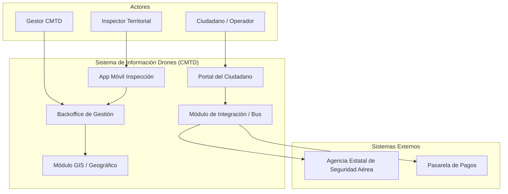
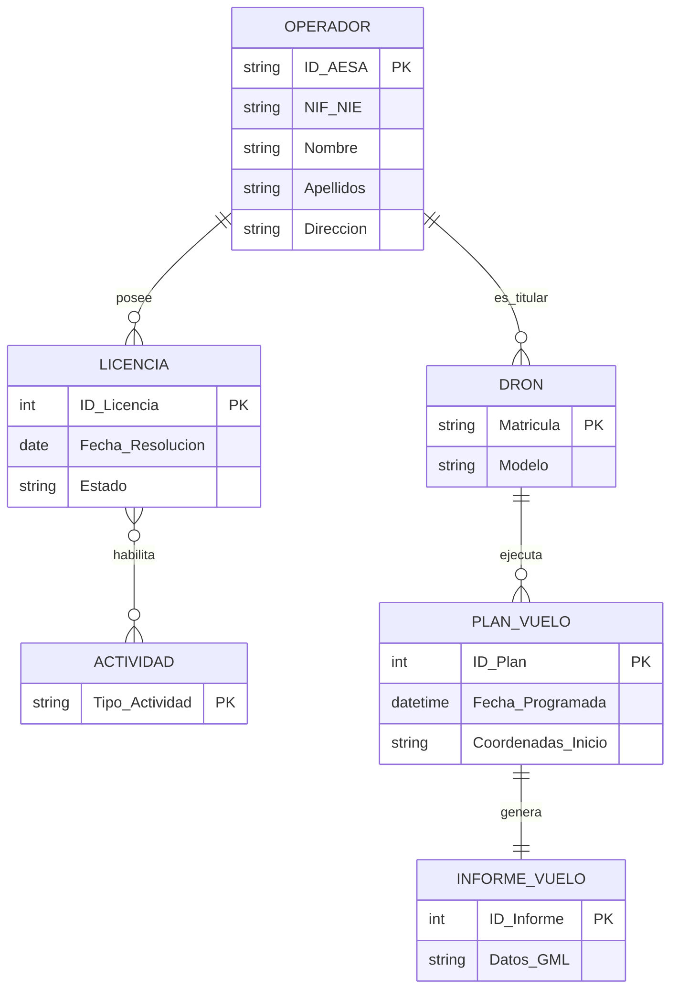
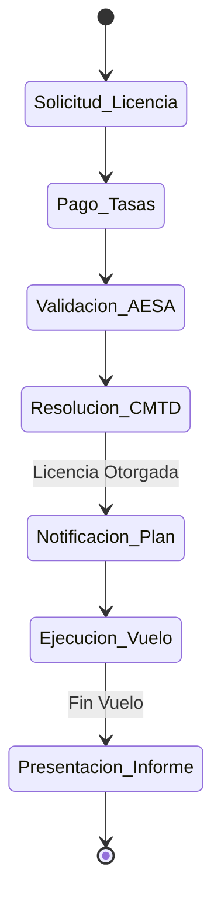
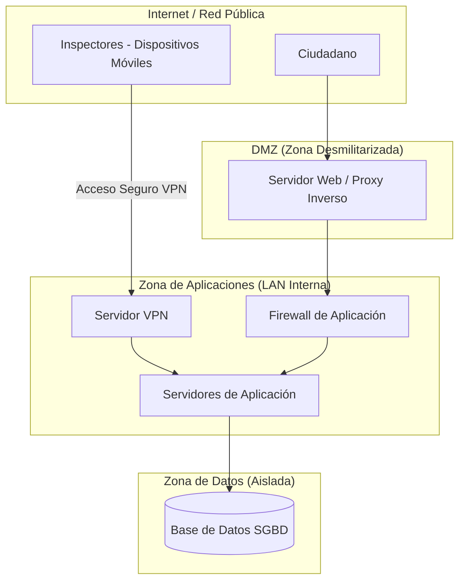
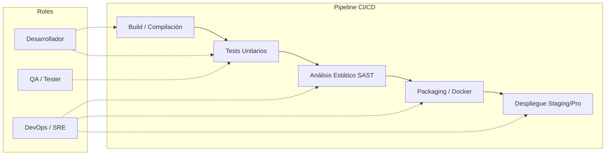

## SUPUESTO TEÓRICO-PRÁCTICO I 

### Pregunta 1: Diagrama Lógico del Sistema 
El sistema se diseña siguiendo una arquitectura modular para separar las interfaces de usuario, la lógica de negocio y la integración con organismos externos.

---

### Pregunta 2: Diagrama Entidad-Relación Extendido 
Modelo conceptual que soporta la trazabilidad entre operadores, sus aeronaves y la actividad realizada.

---

### Pregunta 3: Diagrama de Actividad 
Flujo principal desde la solicitud inicial hasta la presentación del informe final de vuelo.

---

### Pregunta 4: Diagrama de Red Lógico
Infraestructura que permite la supervisión en campo mediante dispositivos móviles seguros[cite: 42, 178].

---

### Pregunta 5: Seguridad y Gestión de Riesgos 
**a) Categoría de Seguridad:**
El sistema se clasifica como de **Categoría MEDIA** conforme al Esquema Nacional de Seguridad (ENS). La pérdida de integridad o confidencialidad de los datos de vuelo y operadores supondría un perjuicio moderado a la seguridad pública y administrativa[cite: 108].

**b) Análisis de Riesgo:** 
* **Activo:** Repositorio de Planes de Vuelo (Datos GML)[.
* **Amenaza:** Interceptación o acceso no autorizado a los planes de vuelo.
* **Medida de Contingencia:** Cifrado de las comunicaciones mediante TLS 1.3 y autenticación multifactor (MFA) para el acceso de inspectores y gestores.

---

## SUPUESTO TEÓRICO-PRÁCTICO II
### Pregunta 6: Propuesta de Pila Tecnológica 
Se propone una modernización hacia una arquitectura de microservicios o monolito modular:
* **Backend:** Java 21 con **Spring Boot** (sustituyendo servlets puros por un framework productivo).
* **Frontend:** **Angular** o React para una interfaz SPA rica, mejorando JSPs tradicionales.
* **API:** REST con JSON para facilitar la interoperabilidad con AESA y apps móviles.

---

### Pregunta 7: Pipeline de CI/CD 
Ciclo de vida automatizado para asegurar entregas rápidas y de calidad.

---

### Pregunta 8: Solución Criptográfica 
Para garantizar confidencialidad y autenticidad del emisor:
1.  **Cifrado Híbrido:** Uso de AES-256 para el contenido y RSA/ECC para el intercambio de claves.
2.  **Firma Electrónica:** Firma del archivo GML mediante certificados X.509v3 (DNIe o certificados de empleado público/operador).
3.  **Formato:** Uso de firmas longevas (**XAdES/PAdES**) con sello de tiempo para asegurar el no repudio.

---

### Pregunta 9: Sistema de Almacenamiento
Diseño de jerarquización de datos (Tiering) basado en la frecuencia de acceso:
* **Tier 1 (Frecuente - 1 mes):** Almacenamiento en Flash/SSD de alto rendimiento (1 TB/mes).
* **Tier 2 (Esporádico - 6 meses):** Cabinas SAS de gran capacidad (aprox. 6 TB acumulados).
* **Tier 3 (Archivo - 5 años):** Almacenamiento en frío (LTO o Cloud Archive) para cumplimiento legal de retención.

---

### Pregunta 10: Eficiencia Energética del CPD 
**a) Cálculos y Resultados:** 
* **PUE (Power Usage Effectiveness):**
  $$PUE = \frac{\text{Energía Total}}{\text{Energía IT}} = \frac{500.000}{400.000} = 1,25$$
* **DCIE (Data Center Infrastructure Efficiency):**
  $$DCIE = \frac{1}{PUE} \times 100 = 80\%$$
* **Interpretación:** Un PUE de 1,25 es excelente, indicando un diseño muy eficiente donde solo el 25% de la energía se usa en refrigeración e infraestructura[cite: 71].

**b) Medidas de Mejora:** 
1.  **Confinamiento de Pasillos:** Pasillo frío/caliente para optimizar el flujo de aire.
2.  **Virtualización de Servidores:** Reducción de hardware físico infrautilizado.
3.  **Free Cooling:** Uso del aire exterior cuando la temperatura ambiente lo permita.

---
### Referencias
1. [Cuestionario Segundo Ejercicio TSI - JCyL](cuestionario+segundo+ejercicio,0.pdf)
2. [Anexo II - Programa TS Informática](ANEXO+II+PROGRAMA+TS+INFORMATICA.pdf)
