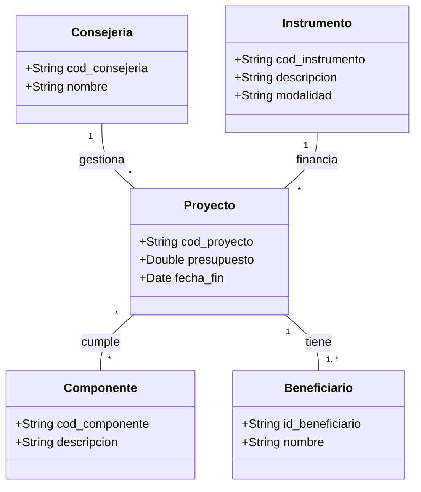
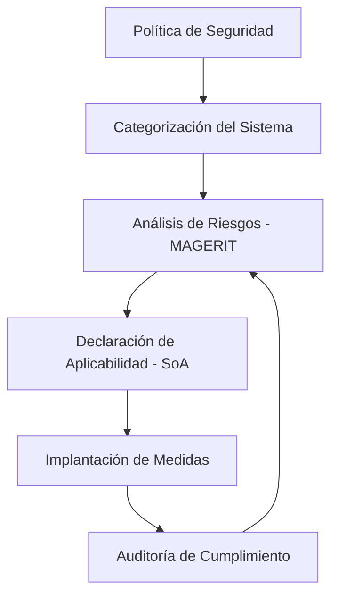

# Resolución Examen Técnico Superior de Informática - JCyL

Este documento contiene la resolución técnica de los supuestos del examen del 26 de febrero de 2022, adaptada al temario oficial y optimizada para una presentación profesional en formato Markdown.

---

## 1. Primer Supuesto: Gestión de Fondos Next Generation EU

### 1.1. Modelo Conceptual (UML)
A continuación se presenta el diagrama de clases que representa la trazabilidad de los fondos desde las consejerías hasta los beneficiarios finales.



### 1.2. Diseño Físico de la Tabla Proyectos (Oracle)
Se implementan claves subrogadas para permitir la modificación de códigos de negocio sin romper la integridad referencial.

```sql
CREATE TABLE PROYECTOS (
    ID_PROYECTO NUMBER GENERATED ALWAYS AS IDENTITY PRIMARY KEY,
    COD_PROYECTO VARCHAR2(20) UNIQUE NOT NULL,
    PRESUPUESTO NUMBER(15, 2) NOT NULL,
    FECHA_FIN DATE NOT NULL,
    ID_CONSEJERIA NUMBER NOT NULL,
    ID_INSTRUMENTO NUMBER NOT NULL,
    CONSTRAINT FK_CONSEJERIA FOREIGN KEY (ID_CONSEJERIA) 
        REFERENCES CONSEJERIAS(ID_CONSEJERIA),
    CONSTRAINT FK_INSTRUMENTO FOREIGN KEY (ID_INSTRUMENTO) 
        REFERENCES INSTRUMENTOS(ID_INSTRUMENTO)
);
```

### 1.3. Consulta ANSI SQL (Presupuesto Acumulado)
```sql
SELECT 
    c.nombre AS "Nombre Consejeria",
    i.descripcion AS "Instrumento",
    i.modalidad AS "Tipo Modalidad",
    SUM(p.presupuesto) AS "Total Presupuesto"
FROM CONSEJERIAS c
CROSS JOIN INSTRUMENTOS i
LEFT JOIN PROYECTOS p ON p.id_consejeria = c.id_consejeria 
                      AND p.id_instrumento = i.id_instrumento
GROUP BY c.nombre, i.descripcion, i.modalidad
ORDER BY c.nombre, i.descripcion;
```

### 1.4. Optimización de Consultas
Para optimizar la búsqueda por consejería, se propone la creación de un **índice B-Tree** sobre la clave foránea:
* **Índice sugerido:** `CREATE INDEX idx_proyectos_consejeria ON PROYECTOS(ID_CONSEJERIA);`

### 1.5. Prevención de SQL Injection (Java/JDBC)
```java
String sql = "SELECT descripcion, presupuesto FROM proyectos WHERE id_consejeria = ?";
try (PreparedStatement pstmt = connection.prepareStatement(sql)) {
    pstmt.setInt(1, idUsuario);
    ResultSet rs = pstmt.executeQuery();
    // Procesamiento de resultados...
}
```
**Justificación:** El uso de `PreparedStatement` asegura que los parámetros se traten como datos y no como código ejecutable, precompilando la sentencia en el motor de la base de datos.

---

## 2. Segundo Supuesto: Infraestructura y Continuidad

### 2.1. Red y Direccionamiento IP
* **Cálculo de Subred:**
  * **Necesidad:** ~30 puestos (Atención, consulta, despachos, juntas e impresoras).
  * **Máscara Mínima:** $/27$ ($255.255.255.224$).
  * **IP de Inicio:** $10.10.100.64$
  * **Última IP disponible:** $10.10.100.94$
  * **Número máximo de direcciones:** $32$ ($30$ útiles).

### 2.2. Continuidad de Negocio: RPO y RTO
Basado en una pérdida de $224$ € por minuto ($32$ transacciones/min $\times$ $7$ €/tx):

$$RTO = \\frac{13.500 \\text{ €}}{224 \\text{ €/min}} \\approx 60 \\text{ minutos}$$

$$RPO = \\frac{80.000 \\text{ €}}{224 \\text{ €/min}} \\approx 357 \\text{ minutos (aprox. 6 horas)}$$

---

## 3. Seguridad y Esquema Nacional de Seguridad (ENS)

### 3.1. Flujo de Implantación (RD 311/2022)


### 3.2. Comparativa de Medidas (Nivel Medio vs. Alto)

| Medida (Anexo II) | Nivel Medio | Nivel Alto (Examen) |
| :--- | :--- | :--- |
| **Continuidad [op.cont.1]** | Plan documentado y pruebas anuales. | **Alta disponibilidad:** Centro de respaldo caliente y RTO < 1h. |
| **Copias [op.exp.4]** | Copias diarias con custodia externa. | **Copias Inmutables:** Frecuencia < 6h para cumplir RPO. |
| **Acceso Remoto [op.ext.2]** | VPN con cifrado. | **VPN + MFA:** Autenticación Multifactor obligatoria. |
| **Monitorización [op.exp.10]** | Registro de eventos básicos. | **SIEM:** Análisis de logs en tiempo real y detección de intrusiones. |

### 3.3. Estrategia de Backup Propuesta (Regla 3-2-1)
Para cumplir con el **RPO de 6 horas**, se diseñará un sistema de **snapshots** cada 4 horas con replicación asíncrona a una ubicación secundaria, garantizando la inmutabilidad de los datos frente a ataques de tipo ransomware.
