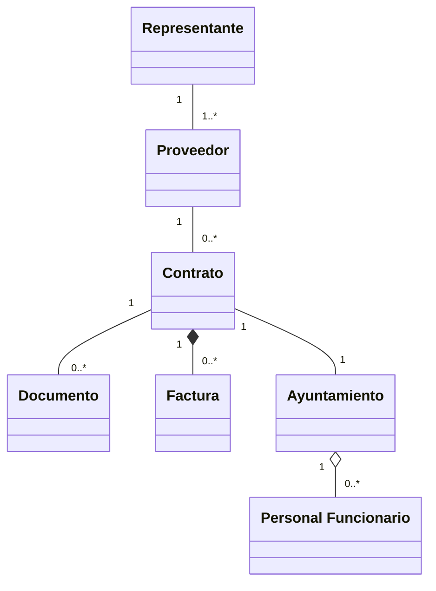

# Examen de Oposición: Analista Programador
**Institución:** Excmo. Ayuntamiento de Salamanca
**Fecha:** 28 de abril de 2023
**Prueba:** Segunda prueba - Oposición libre para la provisión de dos plazas.

---

## Instrucciones
* Cualquier marca que pueda desvirtuar el anonimato del examen está completamente prohibida e invalidará la prueba.
* Esta prueba consta de dos ejercicios. Deberá responder en las hojas suministradas a tal efecto.
* El tiempo de realización de este ejercicio es de 100 minutos.
* No es necesario devolver el cuadernillo. Al finalizar la prueba y una vez entregados todos los exámenes, se solicitarán dos personas voluntarias para que presencien el precintado de los mismos y garantizar la corrección anónima de los exámenes.

---

## Modelo de Dominio (Boceto Inicial)

---

## EJERCICIO 1 (50 puntos)

El Ayuntamiento de una ciudad de 75.000 habitantes ha encargado la construcción de un edificio para el fomento y creación de proyectos de Inteligencia Artificial y Tecnologías Emergentes.

El edificio consta de: planta baja, primera, segunda y tercera. Cada planta tiene unas dimensiones de $25\\,metros$ de ancho por $40\\,metros$ de largo y una altura de $4\\,metros$.

### Cuestiones:

**a) [20 puntos] Sistema de cableado estructurado**
Se desea elaborar una propuesta de un sistema de cableado estructurado para el edificio. Describa todos los subsistemas y justifique todos los elementos necesarios conforme a la norma **CENELEC EN 50173** teniendo en cuenta que:
* Se desea reducir el número de repartidores en el edificio.
* Se deberá considerar 2 puntos de red por cada $10\\,m^2$ de superficie utilizable como trabajo.
* Se desea interconectar este edificio con el resto de los edificios municipales.

**b) [15 puntos] Elementos activos**
Describa y justifique los elementos activos necesarios para dar servicio en cada planta a un departamento.
* Cada departamento cuenta actualmente con 40 equipos (ordenadores y teléfonos IP), con posibilidad de crecimiento del 25%.
* Se deberán minimizar los costes económicos asociados.

**c) [8 puntos] Direccionamiento IP**
Se desea asignar una subred diferente para cada departamento, teniendo en cuenta que se dispone del direccionamiento privado $192.168.4.0/22$.
Indique de forma motivada para cada subred el rango de direcciones IP disponibles para los hosts, máscara de subred y puerta de enlace predeterminada de cada una de estas subredes.

**d) [5 puntos] VLANs**
Describa y justifique una implementación de VLAN sobre esta infraestructura de red.

**e) [12 puntos] Captura de tráfico (Figura 1)**
En relación con la captura de tráfico de red:
* Describa y contextualice el diálogo de las tramas que aparecen en la captura identificando las máquinas implicadas.
* Comente los campos más relevantes de cada uno de los protocolos de la trama seleccionada en cada nivel.
* Explique la encapsulación y desencapsulación de dichos niveles.

*NOTA: Puede realizar las suposiciones que considere oportunas siempre que estén suficientemente motivadas.*

---

## EJERCICIO 2 (50 puntos)

El Ayuntamiento desea incorporar a su Sede electrónica un nuevo espacio para facilitar las gestiones con sus proveedores, en adelante **PORTAL WEB DEL PROVEEDOR**. Este nuevo espacio personalizado contará con los siguientes módulos:

1.  **Módulo de identificación:** permitirá la identificación y acceso de las personas autorizadas conforme con los sistemas de identificación de que disponen las administraciones públicas para este perfil de usuarios.
2.  **Módulo de datos de contacto y representación:** permitirá gestionar la información de contacto del proveedor, así como sus representantes.
3.  **Módulo de contratos:** permitirá visualizar el histórico de contratos con este Ayuntamiento.
4.  **Módulo de facturas:** permitirá registrar las facturas, así como visualizar el histórico y detalle de estas.
5.  **Módulo de analítica y gestión documental:** permitirá la generación de certificados y documentos contables a presentar en otras administraciones públicas, así como otros informes.
6.  **Módulo de comunicaciones y avisos:** permitirá la recepción de avisos y otros comunicados del Ayuntamiento relativos al Portal Web del Proveedor.

Deberá tenerse en cuenta que el Ayuntamiento dispone de un programa informático de gestión contable instalado en un Data Center propio y que la Sede electrónica está alojada en un Data Center Cloud.

### Cuestiones:

**a) [10 puntos] Descripción funcional**
Realice una descripción funcional detallada del sistema propuesto a través de Diagramas de Casos de Uso incluyendo cualquier interacción que suponga con sistemas externos al Portal Web del Proveedor.

**b) [10 puntos] Modelo de dominio**
Represente el modelo de dominio del sistema a través de un Diagrama de Clases, indicando los principales atributos.

**c) [15 puntos] Arquitectura**
Describa y justifique de la forma más detallada posible la arquitectura lógica y la arquitectura física del sistema a implantar teniendo en cuenta las dimensiones de la seguridad según el **ENS**.

**d) [10 puntos] Seguridad**
Describa y justifique una propuesta de, al menos cinco medidas, que permitan identificar y/o evitar vulnerabilidades en la seguridad del sistema propuesto.

**e) [5 puntos] Inteligencia Artificial**
Describa y justifique al menos dos puntos del sistema propuesto a los que sea susceptible de aplicarse la inteligencia artificial y otras tecnologías emergentes identificándolas en cada caso.

*NOTA: En todo lo no definido explícitamente en este ejercicio, podrá realizar las suposiciones que estime oportunas. Tenga en cuenta que no existe una única solución correcta por lo que será necesario razonar y argumentar todas las decisiones tomadas.*

---

## Figura 1. Captura de tráfico de red

### Listado de Tramas

| No. | Time | Source | Destination | Protocol | Length | Info |
| :--- | :--- | :--- | :--- | :--- | :--- | :--- |
| 4 | 4.465642 | 20.1.0.30 | 20.1.0.10 | DNS | 73 | Standard query 0x84f1 A www.cisco.com |
| 5 | 4.467532 | 20.1.0.10 | 192.228.79.201 | DNS | 112 | Standard query 0x5757 A www.cisco.com OPT |
| 6 | 4.500558 | 192.228.79.201 | 20.1.0.10 | DNS | 149 | Standard query response 0x5757 A www.cisco.com NS dnscom.com A 30.0.0.10 OPT |
| 7 | 4.501999 | 20.1.0.10 | 30.0.0.10 | DNS | 96 | Standard query 0x562f A www.cisco.com OPT |
| 8 | 4.561168 | 30.0.0.10 | 20.1.0.10 | DNS | 151 | Standard query response 0x562f A www.cisco.com NS dnscisco.cisco.com A 30.0.0.2 OPT |
| 9 | 4.562412 | 20.1.0.10 | 30.0.0.2 | DNS | 96 | Standard query 0x696e A www.cisco.com OPT |
| 10 | 4.621876 | 30.0.0.2 | 20.1.0.10 | DNS | 105 | Standard query response 0x690e A www.cisco.com A 30.1.0.10 A 30.1.0.20 |
| 11 | 4.623669 | 20.1.0.10 | 20.1.0.30 | DNS | 144 | Standard query response 0x84f1 A www.cisco.com A 30.1.0.10 A 30.1.0.20 NS dnscisco.cisco.com A 30.0.0.2 |

### Detalle de Trama Seleccionada (Frame 4)

* **Ethernet II:**
  * Source: `00:50:79:66:68:00` (Private_66:68:00)
  * Destination: `0c:77:5d:6b:be:00`
  * Type: IPv4 (0x0800)
* **Internet Protocol Version 4:**
  * Source: `20.1.0.30`
  * Destination: `20.1.0.10`
  * Version: 4
  * Header Length: 20 bytes
  * Total Length: 59
  * Identification: `0x4e63` (20067)
  * Time to Live: 64
  * Protocol: UDP (17)
* **User Datagram Protocol:**
  * Source Port: 35384
  * Destination Port: 53
  * Length: 39
* **Domain Name System (query):**
  * Transaction ID: `0x84f1`
  * Flags: `0x0100` Standard query
  * Questions: 1
  * Queries: `www.cisco.com`: type A, class IN
